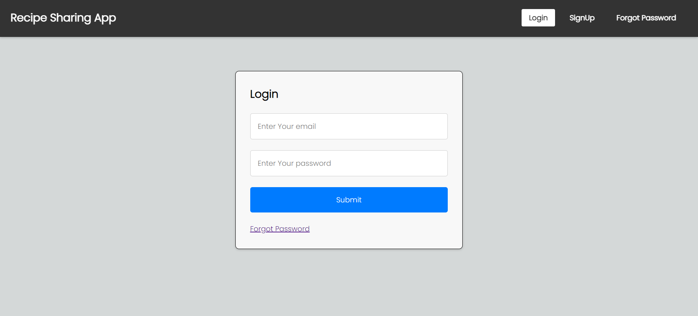
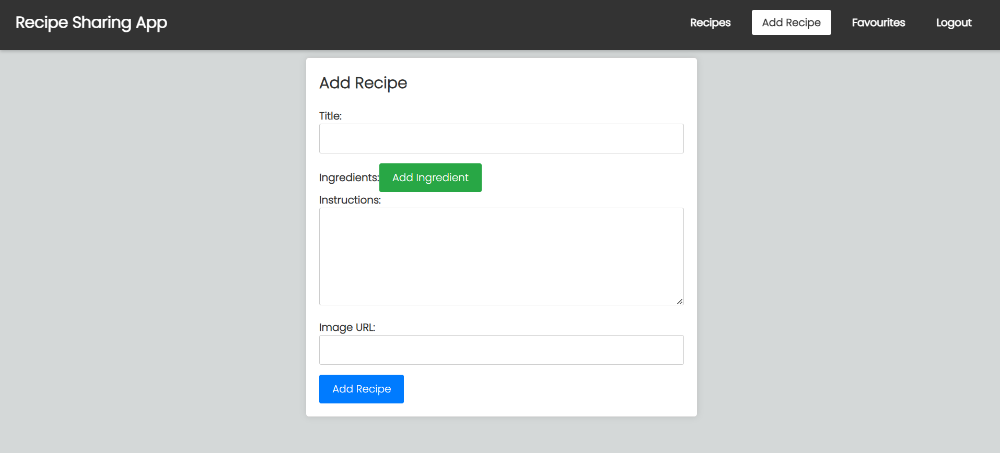

# Recipe Sharing Full Stack App (MERN Stack)

## Table of Contents

- [Screenshots](#screenshots)
- [Features](#features)
- [Prerequisites](#prerequisites)
- [Folder Structure](#folder-structure)
- [Technologies Used](#technologies-used)
  

- ## Screenshots
 
 ;
 ;
 ;
 ;

## Features

1. **User Authentication**: Secure user authentication and registration system.
2. **Recipe Management**: Create, edit, and delete your recipes.
3. **Recipe Discovery**: Browse and search for recipes shared by other users.
4. **Comments and Ratings**: Leave comments and rate recipes.
5. **Favorite Recipes**: Save your favorite recipes for easy access.
6. **Responsive Design**: Works seamlessly on both desktop and mobile devices.

## Prerequisites

- [Node.js](https://nodejs.org/) installed (v14 or higher).
- [MongoDB](https://www.mongodb.com/) installed and running locally or on a remote server.
- [Git](https://git-scm.com/) for version control.
- A text editor or integrated development environment (IDE) of your choice (e.g., Visual Studio Code).
## Folder Structure
The project follows a standard MERN stack folder structure:

- client: Contains the React frontend application.
- server: Contains the Express.js backend application.
- Schema: Define the MongoDB schemas and models.
- routes: Define the API routes.
- controllers: Handle route logic and interact with the database.
- middlewares: Custom middleware functions.
- db: Configuration files (e.g., database connection).

## Technologies Used
#### Frontend:

- React

#### Backend:

- Node.js
- Express.js
- MongoDB (Mongoose)
- JSON Web Tokens (JWT) for authentication
- bcrypt for secured password hashing

